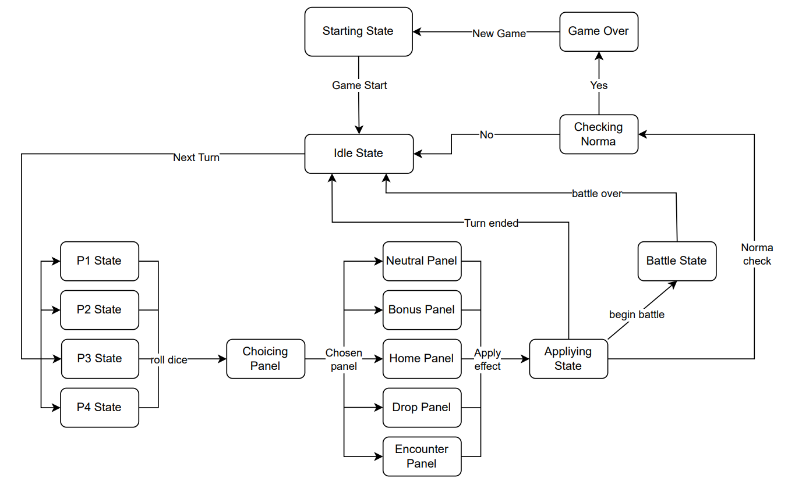

# 99.7% Citric Liquid

## About

`99.7% Citric Liquid` is a simplified clone of the renowned game, `100% Orange Juice`. Its main
purpose is to serve as an educational tool, teaching foundational programming concepts.

📢 **Note**: This project is purely educational and will not be used for any commercial purposes.

---

## Tarea 3: Entrega Parcial 6

### Estados

A continuación, se esboza una idea inicial del diagrama de estados del juego.



```scala

trait GameState {
  def startGame(): Unit

  def rollDice(): Unit
  
  def applyEffect(): Unit
  
  def choosePanel(): Unit
  ...
}
```

En base a los estados mostrados anteriormente, se procederá a implementarlos.

### Controlador

Se va a proceder a implementar el controlador del juego, el cual se encargará de manejar los estados del juego.

```scala

class GameController {
// Estado actual del juego
var state: GameState = new StartState(this)

    def startGame(): Unit = { 
        state.startGame()
        /* ... */
    }

    def rollDice(): Unit = {
        /* ... */
    }

    def applyEffect(): Unit = {
        /* ... */
    }
      ...
}
```

<div style="text-align:center;">
    
</div>

This project is licensed under the [Creative Commons Attribution 4.0 International License](http://creativecommons.org/licenses/by/4.0/).

---
